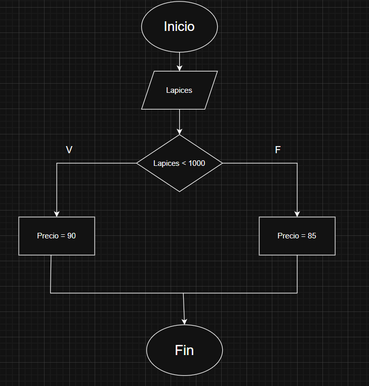
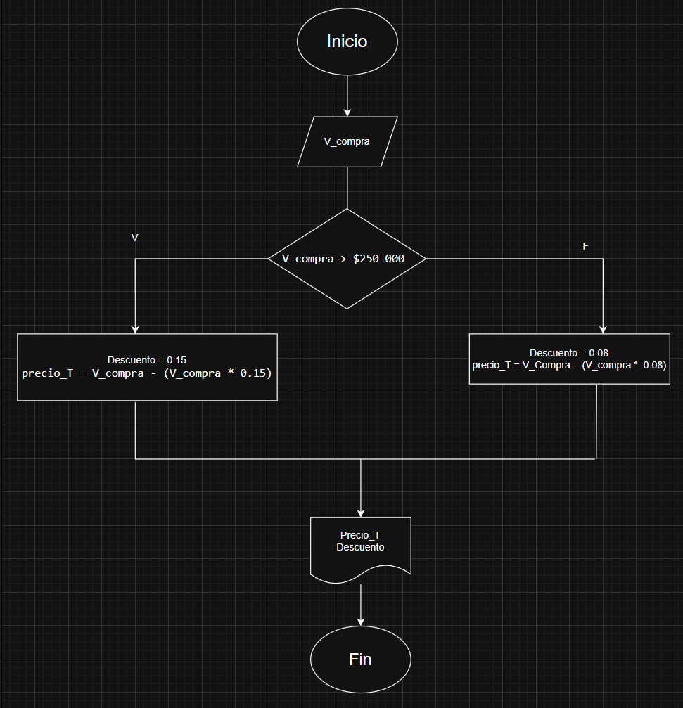
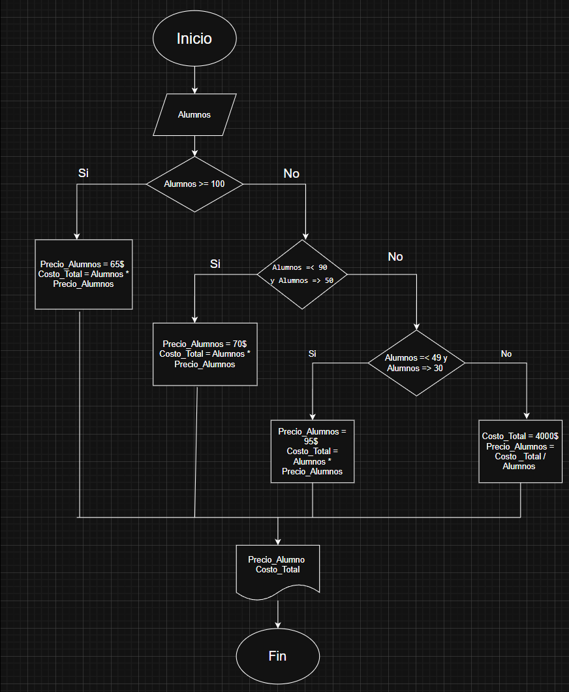

# Representación de algoritmos

Existen dos tipos principales:

1. **Cualitativos**: Describen pasos a través de palabras. Por ejemplo, las instrucciones para preparar una receta de cocina, como "mezclar los ingredientes" u "hornear durante 30 minutos", constituyen un algoritmo cualitativo.
2. **Cuantitativos**: Incluyen cálculos numéricos. Por ejemplo, un algoritmo para calcular el volumen de una caja: `Volumen = Largo * Ancho * Alto`.

# Ejercicio 1 

# Ejercicio 2 
- Construye un algoritmo que, al recibir como datos el ID del empleado y los seis primeros sueldos del año, calcule el ingreso total semestral y el promedio mensual, e imprima el ID del empleado, el ingreso total y el promedio mensual.

#### Datos de entrada. 
|Nombre|Descripción| 
|---|---|
|Id|Número de identificación del empleado(Númerico)|
|S1,S2,S3,S4,S5,S6|Los sueldos de los seis meses| 

#### Datos intermedios.
    En este caso no los habrian ya que se puede pasar de los datos iniciales a los finales con un proceso sencillo, pero viendolo desde otro modo, los datos intermedios y los finales podrian coincidir en este caso. 

#### Datos de salida.
|Nombre|Descripción|
|---|---|
|$I_T$|Ingerso total en los seis meses|
|P|Promedio de ingresos mensual|

### Pseudocódigo
Inicio   
Leer Id, S1, S2, S3, S4, S5, S6     
$I_T$ = S1 + S2 + S3 + S4 + S5 + S6       
P = $I_T$ / 6             
Mostrar Id, $I_T$, P          
Fin  

### Diagrama de flujo. 

# Ejercicios 3.

#### 1. Un acuario necesita determinar cuántos litros o galones (eso lo decide el usuario) de agua caben en un acuario, pero solo dispone de una cinta métrica (en centímetros). Diseña un algoritmo para solucionar el problema. 

#### Datos de entrada. 

|Datos|Descripción|
|---|---|  
|Largo|Largo del tanque en cm|
|Ancho|Ancho del tanque en cm|
|Alto|Alto del tanque en cm|
|Unidad|Litros o galones| 

#### Datos Intermedios.
|Dato|Descripción|
|---|---|
|$Volumen_{cm^3}$|La multiplicación de Largo, Ancho,Alto|

#### Datos de salida. 
|Datos|Descripción|
|---|---|
|$Volumen_L$|Volumen en litros|
|$Volumen_{gal}$|Volumen en galones|

### Pseudocódigo
 
Inicio    
Mostrar "Ingresa las medidas del tanque en cm"    
Leer Largo Ancho Alto    
Mostrar  "Selecciona Litros o Galones"      
Leer Unidad
$Volumen_{cm^3}$ = Largo * Ancho * Alto    

Si Unidad = Litros  

     Volumen_L = Volumen_cm^3 /1000
     Mostrar Volumen_L

Si no

    Volumen_gal = Volumen_cm^3 / 3785.45
    Mostrar Volumen_gal

Fin si   

Fin   

### Diagrama de flujo. 

2. Realice un algoritmo para determinar cuánto se debe pagar por equis cantidad de lápices considerando que si son 1000 o más el costo es de $85 cada uno; de lo contrario, el precio es de $90. Represéntelo con el pseudocódigo y el diagrama de flujo.

#### Dato de entrada. 
|Dato|Descripción|
|---|---|
|Lapices||Cantiad de lapices|

#### Dato intermedios.
|Dato|Descripcón|
|---|---|
|Precio|Precio de los lapices|

#### Dato de salida.
|Dato|Descripción|
|---|---|
|$Precio_T$|Precio de todos los lapices|

### Pseudocódigo

Inicio     
Leer Lapices

Si lapices < 1000   

    Precio = 90 

Si no    

    Precio = 85 

Fin si    
$Precio_T$ = Lapices * Precio     
Mostrar $Precio_T$   
Fin 

### Diagrama de flujo.

3. Un almacén de ropa tiene una promoción: por compras superiores a $250 000 se les aplicará un descuento de 15%, de caso contrario, sólo se aplicará un 8% de descuento. Realice un algoritmo para determinar el precio final que debe pagar una persona por comprar en dicho almacén y de cuánto es el descuento que obtendrá. Represéntelo mediante el pseudocódigo y el diagrama de flujo.

#### Datos de entrada. 
|Datos|Descripción|
|---|---|
|V_compra|Valor de la compra|

#### Datos intermedios. 

    En este caso no hay Datos intermedios 

#### Datos de salida. 
|Datos|Descripción|
|---|---|
|Precio_T|Precio total de la compra| 
|Descuento|Descuento aplicado a la compra| 

### Pseudocodigo.
Inicio 
Leer V_compra 

Si  V_compra > $250 000 

    Descuento = 0.15
    Precio_T = V_compra - (V_compra * 0.15)

Si no 

    Descuento = 0.08
    Precio_T = V_compra - (V_compra * 0.08)

Fin si 

Mostrar Precio_T Descuento 

Fin

### Diagrama de flujo. 

4. El director de una escuela está organizando un viaje de estudios, y requiere determinar cuánto debe cobrar a cada alumno y cuánto debe pagar a la compañía de viajes por el servicio. La forma de cobrar es la siguiente: si son 100 alumnos o más, el costo por cada alumno es de $65.00; de 50 a 99 alumnos, el costo es de $70.00, de 30 a 49, de $95.00, y si son menos de 30, el costo de la renta del autobús es de $4000.00, sin importar el número de alumnos.

#### Datos de entrada. 
|Datos|Descripción|
|---|---|
|Alumnos|Número de alumnos|

#### Datos intermedios 

|Datos|Descripción| 
|---|---|
|Categoria de costo|Segun el numero de alumnos que costo frenta a la renta del auto sera el aplicado|

#### Datos intermedios

|Datos|Descripción| 
|---|---|
|Precio_Alumnos|El precio que cada uno de los estudiantes debe pagar|
|Costo_Total|El valor total pagado a la compañia de viajes|

### Pseudocódigo

Inicio       
Leer Alumnos       
Si Alumnos >= 100

    Precio_Alumnos = 65$
    Costo_Total = Alumnos * Precio_Alumno

        Si no 
        si Alumnos =< 90 y Alumnos => 50 

            Precio_Alumnos = 70$
            Costo_Total = Alumnos * Precio_Alumno

            Si no 
            Si Alumnos =< 49 y Alumnos => 30 

                Precio_Alumnos = 95$
                Costo_Total = Alumnos * precio_Alumnos

                    Si no
                    Costo_Total = 4000
                    Precio_Alumnos = Costo_Total / Alumnos

                    Fin si 
                Fin si
            Fin si 
    
Mostrar Precio_Alumno, Costo_Total   
Fin

### Diagrama de flujo. 

# Actividad de evalución: Comprensión de conceptos. 

### Parte 1: Identificar Algoritmos

Responde si los siguientes enunciados representan un algoritmo. Justifica la respuesta:

1. Una página web.
2. Una receta para hacer un pastel, donde se indican ingredientes y pasos a seguir.
3. "Piensa en un número y multiplícalo por otro".
4. Un manual de instrucciones para armar un mueble, con pasos detallados y un orden claro.
5. Una lista de compras organizada en orden alfabético

## Solución 

1. No es un algoritmo. Una página web es solo información o contenido, no un conjunto de pasos ordenados para resolver un problema.

2. Sí es un algoritmo. Tiene instrucciones claras, ordenadas y finitas que llevan a un resultado: el pastel.

3. No es un algoritmo. Es demasiado vago, no define pasos concretos ni asegura un resultado específico

4. Sí es un algoritmo. Presenta pasos secuenciales y precisos que garantizan llegar al objetivo: armar el mueble.

5. No es un algoritmo. Es solo un conjunto de datos ordenados, pero no describe un proceso para resolver algo.

### Parte 2: Variables y Constantes
Indica si las siguientes afirmaciones describen una variable o una constante:

1. El valor de la gravedad en la Tierra, 9.8 m/s².
2. La edad de una persona calculada con base en el año actual y su año de nacimiento.
3. La cantidad de dinero en una cuenta bancaria.
4. La velocidad de la luz en el vacío, 299,792,458 m/s.
5. El radio de un círculo.

## Solución 

1. Es una constante, porque ese valor no cambia
2. Es una variable, porque depende de cada persona y además cambia con el tiempo.
3. Es una variable, porque puede aumentar o disminuir según depósitos o retiros.
4. Es una constante, porque es un valor fijo y universal.
5. Es una variable, porque depende del círculo específico que se esté considerando. 

### Parte 3: Características de los Algoritmos
Responde si los siguientes enunciados cumplen con las características de un algoritmo. Justifica la respuesta: 
1. Para elegir la ruta más corta entre varias ciudades, el algoritmo examina rutas candidatas, deteniéndose cuando los cambios en la distancia parecen lo suficientemente pequeños.
2. Suma los números ingresados y muestra el resultado.
3. Un conjunto de pasos para calcular el área de un rectángulo dado su base y altura.
4. El algoritmo cuenta el número de votos obtenidos por cada uno de los candidatos de una elección para presidente. Empieza solicitando el nombre del candidato y finaliza cuando se ingresa el valor -1.

## Solución 
1. No cumple totalmente con las características de un algoritmo, porque no garantiza un resultado exacto ni finito. La instrucción de “cuando los cambios parecen lo suficientemente pequeños” es ambigua y subjetiva.
2. Sí es un algoritmo. Tiene pasos claros, finitos y produce un resultado definido: la suma.
3. Sí es un algoritmo. Es preciso, finito y siempre lleva a un resultado correcto: el área.
4. Sí es un algoritmo. Tiene un inicio, un proceso definido (contar votos) y una condición clara de finalización (-1).

### Parte 4: Comprensión de Herramientas
Indica si las siguientes afirmaciones son ciertas o falsas respecto al pseudocódigo y diagramas de flujo:

1. El pseudocódigo utiliza símbolos estándar para representar las operaciones lógicas.
2. Los diagramas de flujo son una representación gráfica de un algoritmo.
3. El pseudocódigo debe estar escrito en un lenguaje de programación específico.
4. Un diagrama de flujo siempre debe tener un inicio y un fin claramente definidos.

## Solcuión 
1. Falso. El pseudocódigo se escribe con lenguaje natural estructurado, no con símbolos gráficos.
2. Cierto. Justamente muestran el proceso mediante figuras y flechas que representan el flujo de pasos.
3. Falso. No depende de un lenguaje de programación, se escribe de forma libre pero ordenada.
4. Cierto. Es una regla básica: todo algoritmo representado gráficamente debe mostrar dónde empieza y dónde termina.

### Parte 5: Estructuras de Control
Describe para qué sirven las estructuras de control. Redacta dos ejemplos, uno de tu vida diaria, es decir cuando tienes que tomar decisiones en tus actividades diarias y oto ejemplo en el que se tengan que utilizar cálculos matemáticos para tomar una u otra decisión.

## Solución 
Las estructuras de control sirven para decidir qué camino tomar dentro de un algoritmo o programa. Básicamente, permiten que el flujo de instrucciones cambie dependiendo de condiciones o repeticiones. Sin ellas, todo sería lineal y no podríamos manejar decisiones ni ciclos.

### Ejemplo 1. 
Cúando tengo que decidir en que transporte ir a la U. 

    Si el metro esta funcionando, Tomo el metro porque es más barato. 

    si no, Tomo un didimoto. 

### Ejemplo 2. 
Cúando se organiza una salida con los amigos. 
- Calculamos el presupuesto que tenemos para hacer x actividad. 

    Si el costo <= presupuesto que disponemos, hacemos x actividad. 

        si no, Buscamos otra actividad más barato o de plano no salimos. 

