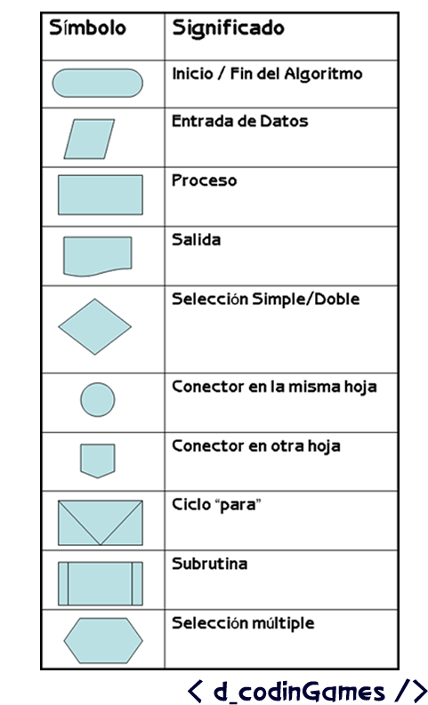
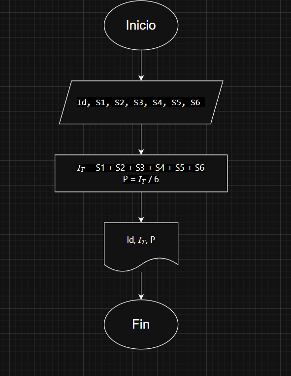
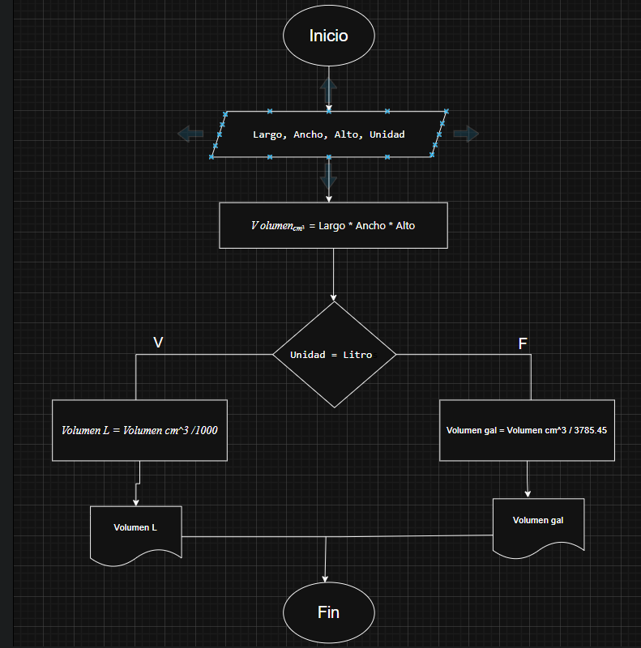

# Representación de algoritmos

Existen dos tipos principales:

1. **Cualitativos**: Describen pasos a través de palabras. Por ejemplo, las instrucciones para preparar una receta de cocina, como "mezclar los ingredientes" u "hornear durante 30 minutos", constituyen un algoritmo cualitativo.
2. **Cuantitativos**: Incluyen cálculos numéricos. Por ejemplo, un algoritmo para calcular el volumen de una caja: `Volumen = Largo * Ancho * Alto`.

# Ejercicio 1 

# Ejercicio 2 
- Construye un algoritmo que, al recibir como datos el ID del empleado y los seis primeros sueldos del año, calcule el ingreso total semestral y el promedio mensual, e imprima el ID del empleado, el ingreso total y el promedio mensual.

#### Datos de entrada. 
|Nombre|Descripción| 
|---|---|
|Id|Número de identificación del empleado(Númerico)|
|S1,S2,S3,S4,S5,S6|Los sueldos de los seis meses| 

#### Datos intermedios.
    En este caso no los habrian ya que se puede pasar de los datos iniciales a los finales con un proceso sencillo, pero viendolo desde otro modo, los datos intermedios y los finales podrian coincidir en este caso. 

#### Datos de salida.
|Nombre|Descripción|
|---|---|
|$I_T$|Ingerso total en los seis meses|
|P|Promedio de ingresos mensual|

### Pseudocódigo
Inicio   
Leer Id, S1, S2, S3, S4, S5, S6     
$I_T$ = S1 + S2 + S3 + S4 + S5 + S6       
P = $I_T$ / 6             
Mostrar Id, $I_T$, P          
Fin  

### Diagrama de flujo. 

# Ejercicios 3.
1. Un acuario necesita determinar cuántos litros o galones (eso lo decide el usuario) de agua caben en un acuario, pero solo dispone de una cinta métrica (en centímetros). Diseña un algoritmo para solucionar el problema. 

#### Datos de entrada. 

|Datos|Descripción|
|---|---|  
|Largo|Largo del tanque en cm|
|Ancho|Ancho del tanque en cm|
|Alto|Alto del tanque en cm|
|Unidad|Litros o galones| 

#### Datos Intermedios.
|Dato|Descripción|
|---|---|
|$Volumen_{cm^3}$|La multiplicación de Largo, Ancho,Alto|

#### Datos de salida. 
|Datos|Descripción|
|---|---|
|$Volumen_L$|Volumen en litros|
|$Volumen_{gal}$|Volumen en galones|

### Pseudocódigo
 
Inicio    
Mostrar "Ingresa las medidas del tanque en cm"    
Leer Largo Ancho Alto    
Mostrar  "Selecciona Litros o Galones"      
Leer Unidad
$Volumen_{cm^3}$ = Largo * Ancho * Alto    

Si Unidad = Litros  

     Volumen_L = Volumen_cm^3 /1000
     Mostrar Volumen_L

Si no

    Volumen_gal = Volumen_cm^3 / 3785.45
    Mostrar Volumen_gal

Fin si   

Fin   

### Diagrama de flujo. 

2. 