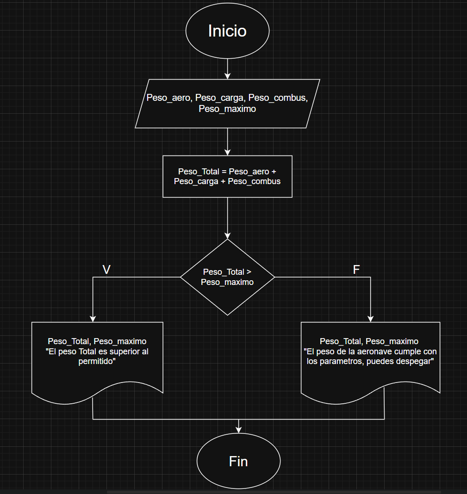

# Taller de Algoritmos. 

### Ejercicios con condicionales. 

1. #### Verificación de peso de despegue. 
En una pista de pruebas de aeronaves, el sistema debe verificar si el peso total de la aeronave, incluyendo combustible y carga, supera el límite máximo permitido para el despegue. Dependiendo del resultado, el sistema deberá indicar si la aeronave está lista para despegar o si debe reducir carga o combustible. 

#### Datos de entrada.

|Datos|Descripción| 
|---|---|
|Peso_aero|Peso de la aeronave|
|Peso_carga|Peso de la carga que se embarcara en la aeronave|
|Peso_combus|Peso del combustible que se depositara en la aeronave| 
|Peso_maximo|Peso maximo con el cual la aeronave puede salir a vuelo de forma segura| 

#### Datos de salida 

|Datos|Descripción| 
|---|---|
|Peso_Total|Peso total de la aeronave|

#### Diagrama de flujo. 

